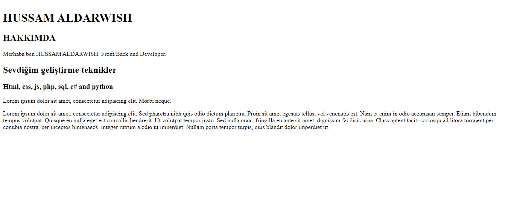

# Ödev 1: İlk Web Sayfamızı Oluşturmak
https://app.patika.dev/moduller/html/odev1

  

Eveet harika konular öğrendikten sonra sıra geldi ödevimize. Bu ödevimizde ilk web sayfamızı tasarlayacağız. Çok heyecanlı değil mi? Sizlerden istediğimiz çok basit bir şekilde öğrendiklerinizle bir web sayfası tasarlamanız.

- Siteyi açtığımızda adınız ve soyadınızı başlık şeklinde göstermeniz gerekiyor.
- Ad-Soyadın altında alt başlık olarak Hakkımda yazmalıdır.
- Altına paragraf içerisinde neler yaptığınızı ve nelerden hoşlandığınızı yazabilirsiniz.
- Web sitenizi kaydederken dosya adı olarak 'index.html' seçmeniz gerekmektedir.
- Yazdığınız kodları açıklayan yorum satırları eklemeyi unutmayın.

